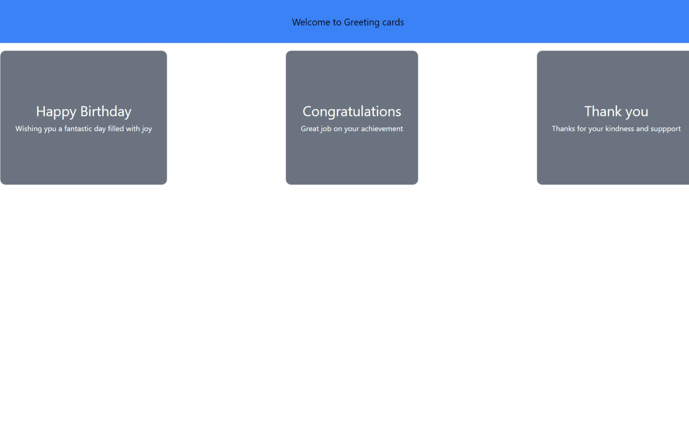

<!-- Please update value in the {}  -->

<h1 align="center">A Node Js Backend Server</h1>

<!-- OVERVIEW -->

## Overview
This application/project was created as a submission to my Web Technologies Course assign on how to create a server with endpoint using node js with express

## Screenshots
- Main Interface

### Built With

<!-- This section should list any major frameworks that you built your project using. Here are a few examples.-->

- [Node JS](https://www.w3schools.com/nodejs/)
- [Vite + React](https://dev.to/mcbarna/setup-react-with-vite-on-vscode-a-step-by-step-tutorial-591g)

## Contact
- GitHub [@EMA-Wolf](https://github.com/EMA-Wolf)